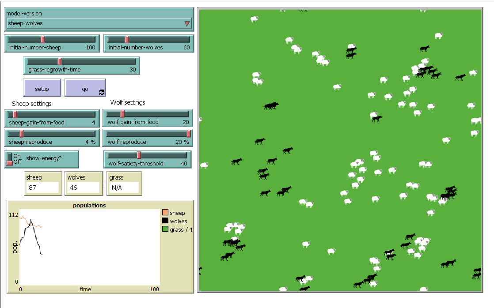

## Комп'ютерні системи імітаційного моделювання
## СПм-22-3, **Риндик Ігор Вікторович**

### Лабораторна робота №**2**. Редагування імітаційних моделей у середовищі NetLogo

 

### Варіант 7, модель у середовищі NetLogo:
[Wolf Sheep Predation](http://www.netlogoweb.org/launch#http://www.netlogoweb.org/assets/modelslib/Sample%20Models/Biology/Wolf%20Sheep%20Predation.nlogo)

Прибрати "зграйність" вовків - теперь перед початком свого ходу вовки повинні "оглядатися", перевіряючи оточення, та обирати напрямок руху виходячи з наявності овець та відсутності інших вовків. Якщо немає іншої можливості – переміщається випадково. При знаходженні на одній ділянці поля двох вовків залишається лише один з них. Вівці переміщаються випадковим чином, але при виявленні вовка на одній із клітин поруч змінюють напрямок на протилежний.

 

### Внесені зміни у вихідну логіку моделі, за варіантом:
Зміна процедури переміщення вовків для того щоб прибрати зграйність і додати перевірку на оточення:

замість
<pre>
ask wolves [
    move
    ; code was simplified
  ]
</pre>
було додано нову процедуру переміщення вовків:
<pre>
ask wolves [
    move-wolf
    ; code was simplified
  ]
</pre>

Код нової процедури:
<pre>
to move-wolf  ; wolf move procedure
  ; check if there are any sheep or wolfs in near 3 patch
  let has-sheep-neighbor any? sheep in-radius 3
  let has-wolves-neighbor any? other wolves in-radius 3

  ; if there is any sheep neighbor need to move in her direction
  if has-sheep-neighbor [
    ; get the closest sheep and move
    let closest-sheep min-one-of sheep in-radius 3 [distance myself]
    face closest-sheep
    fd 1
    stop
  ] 
  if not has-wolves-neighbor [
    ; if there are any sheep and wolves nearby move random
    move
    stop
  ]
  if has-wolves-neighbor [
    ; get the closest wolf and move in opposite direction
    let closest-wolf min-one-of other wolves in-radius 3 [distance myself]
    move-opposite closest-wolf
  ]
end
</pre>

Також для подальшого використання подібного коду була створена процедура руху в протилежну сторону від агента:

<pre>
to move-opposite [target-turtle]
  let angle towards target-turtle
  set heading (angle + 180)
  fd 1  ; Move forward by 1 unit in the opposite direction
end
</pre>

Зміна процедури руху вівці:

<pre>
to move-sheep  ; sheep move procedure
  ; check if there are any wolfs in near 3 patch
  let has-wolves-neighbor any? wolves in-radius 3
  ifelse has-wolves-neighbor [
    ; get the closest wolf and move in opposite direction
    let closest-wolf min-one-of wolves in-radius 3 [distance myself]
    move-opposite closest-wolf
  ] 
  ; if there is no wolf nearby move random
  [
    move
  ]
end
</pre>

Додано процедуру яка гарантує що лише один вовк може бути на одній ті ж самій клітинці

<pre>
to enforce-one-wolf-per-patch
  ask wolves [
    if any? other wolves-here [
      ; if there is more than one wolf on the same patch, remove one of them
      ask one-of other wolves-here [ die ]
    ]
  ]
end
</pre>

Виклик процедури додано перед переміщенням агентів:

<pre>
to go
  ; stop the model if there are no wolves and no sheep
  if not any? turtles [ stop ]
  ; stop the model if there are no wolves and the number of sheep gets very large
  if not any? wolves and count sheep > max-sheep [ user-message "The sheep have inherited the earth" stop ]
  
  ; Enforce the condition before wolf movement
  enforce-one-wolf-per-patch
  
  ask wolves [
   ; code was simplified
  ]
   ; code was simplified 
end
</pre>

### Внесені зміни у вихідну логіку моделі, на власний розсуд:

Додано міру "ситості" для вовків. Використовується вказане користувачем відсоткове значення ситості, при якому вовк не поїдатиме овець.

Нова властивість у агента:

<pre>
turtles-own [ energy satiety ]
</pre>

Зміна процедури поєдання вівці вовком:

<pre>
to eat-sheep  ; wolf procedure
  let prey one-of sheep-here                    ; grab a random sheep
  if prey != nobody  [                          ; did we get one? if so,
    ask prey [ die ]                            ; kill it, and...
    set energy energy + wolf-gain-from-food     ; get energy from eating
  ]
end
</pre>
 
 Нова версія процедури, добавлено перевірку ситності вовка, та додавання ситності, коли вовк з'їдає вівцю:

<pre>
to eat-sheep  ; wolf procedure
  if satiety <= wolf-satiety-threshold [
    let prey one-of sheep-here                    ; grab a random sheep
    if prey != nobody  [                          ; did we get one? if so,
      ask prey [ die ]                            ; kill it, and...
      set energy energy + wolf-gain-from-food     ; get energy from eating
      let satietyForSheep random (50 - 30 + 1) + 30
      set satiety satiety + satietyForSheep       ; increase satiety when eating a sheep
      if satiety > 100
        [set satiety 100]
    ]
  ]
end
</pre>

В головній процедурі додано віднімання ситності з кожним кроком часу:

<pre>
to go
  ; code was simplified

  ask wolves [
    move
    set energy energy - 1 ; wolves lose energy as they move
    eat-sheep
    death
    reproduce-wolves
    if satiety > 0 [ set satiety satiety - 1 ] ; Decrease satiety over time
  ]

  ; code was simplified
end
</pre>

Фінальний код моделі та її інтерфейс доступні за [посиланням](example-model.nlogo).

## Обчислювальні експерименти

### 1. Вплив параметру порогу ситості вовка на популяцію вівець та вовків
Досліджується чутливість моделі до зміни порогу ситності, зосереджуючись на тому, як невеликі зміни в цих показниках впливають на динаміку популяції. Порівнюються розміри популяції наприкінці кожного експерименту з базовим сценарієм.
Визначається, як зміни темпів розмноження впливають на ріст популяції, рівновагу та загальну динаміку хижак-жертва.

<table>
<thead>
<tr><th>Поріг ситності вовків</th><th>Кількість вівець</th><th>Кількість вовків</th></tr>
</thead>
<tbody>
<tr><td>50</td><td>258.08</td></tr>
<tr><td>100</td><td>258.7</td></tr>
<tr><td>200</td><td>258.8</td></tr>
<tr><td>250</td><td>258.89</td></tr>
</tbody>
</table>